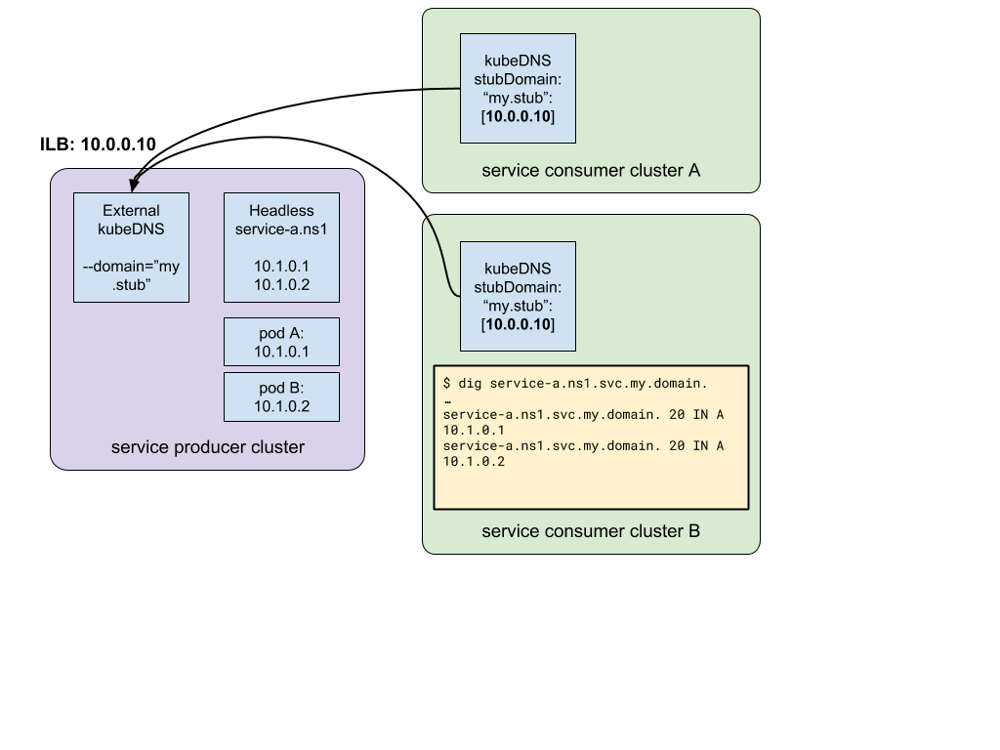

# Service discovery (via DNS) for headless services across clusters

This setup will create a kubedns instance that exposes Kubernetes service mappings for DNS across Kubernetes clusters. The use case for this setup is where you have multiple clusters one of which hosts headless services shared with the other clusters, e.g. a shared database or control plane and the shared service is discovered using Kubernetes DNS mappings.

Caveats: ILB cannot share the same IP between the UDP and TCP DNS services, meaning this will be limited to UDP-based name resolution.

## Setup

### Service producer cluster

* Setup external KubeDNS server, configured with domain set to your stub domain (“my.stub” in the example.): [yaml](https://github.com/bowei/expose-kubedns/blob/master/producer/external-kubedns.yaml).
* Expose external KubeDNS as an ILB service: [yaml](https://github.com/bowei/expose-kubedns/blob/master/producer/external-kubedns-service.yaml).
* Expose any services that need to have cross cluster DNS mappings as a headless service. [yaml](https://github.com/bowei/expose-kubedns/blob/master/producer/service.yaml)

### Service consumer cluster

* Set the [stub domain](http://blog.kubernetes.io/2017/04/configuring-private-dns-zones-upstream-nameservers-kubernetes.html) (e.g. “my.stub”) to point to the ILB. [yaml](https://github.com/bowei/expose-kubedns/blob/master/consumer/kubedns-configmap.yaml)
